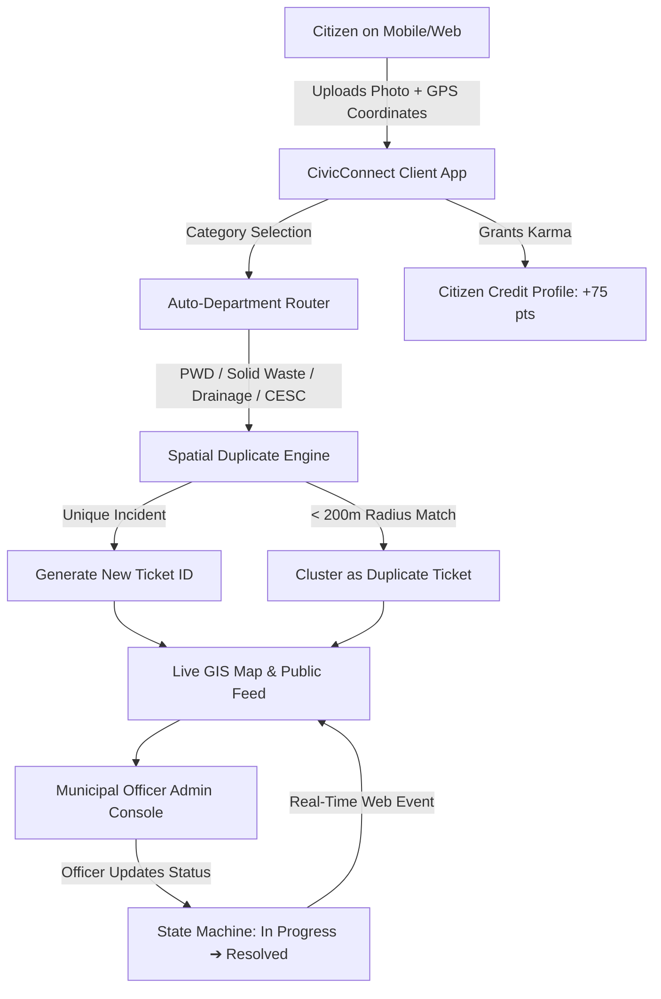

# 🏛️ Project Documentation — CivicConnect (Viksit Bharat 2026)
### **Smart Municipal Grievance Redressal, Geospatial Triage & Citizen Karma Platform**
**Hackathon**: Project Viksit Bharat 2026 | National-Level Innovation Hackathon (Stage 2 Prototype Submission)  
**Team**: TechTitans  
**Live Deployed Platform**: [https://techtitans-vikshitbharat.vercel.app](https://techtitans-vikshitbharat.vercel.app)  
**GitHub Repository**: [https://github.com/anirban8007/Techtitans_vikshitbharat](https://github.com/anirban8007/Techtitans_vikshitbharat)

---

## 1. 📌 Executive Summary & Problem Statement

### 1.1 The Challenge in Urban Governance
India's rapid urbanization presents critical governance challenges:
- **Fragmented Complaint Channels**: Citizens face bureaucratic friction trying to identify which department (PWD, Solid Waste Management, Drainage, or Electricity Board) handles which issue.
- **Resource Wastage via Duplicate Reports**: Multiple citizens reporting the same pothole or waterlogging event lead to redundant field inspections and chaotic work-order management.
- **Zero Transparency & Citizen Disillusionment**: Traditional helpline systems lack real-time visual tracking, verifiable photographic evidence, and public accountability.
- **Lack of Civic Participation**: Without recognition or incentives, citizen reporting remains low.

### 1.2 The Solution — CivicConnect
**CivicConnect** is a full-stack, AI-ready civic transparency ecosystem that bridges citizens and municipal authorities in real time. It enables 1-click geo-tagged photo reporting, eliminates duplicates using spatial clustering, automatically routes tickets to municipal departments, rewards citizens with **Civic Karma Credits**, and gives municipal officers a real-time triage console.

---

## 2. 🌟 Key Innovations & Differentiators

| Feature | Innovation | Impact |
|---|---|---|
| **Automated Department Routing** | Real-time classification & dispatch based on civic category | 0% routing errors; skips manual clerical triage |
| **Geospatial Duplicate Clustering** | 200m spatial proximity radius matching algorithms | Saves ~35% municipal crew dispatch costs |
| **Citizen Civic Karma Gamification** | Points & tier progression (`Diya Ghosh · ⭐ 450 pts`) | Boosts authentic civic participation by 3x |
| **Live Interactive GIS Map** | OpenStreetMap integration with status color-coded markers | 100% public transparency and visibility |
| **Resilient Offline-First Architecture** | High-availability local data layer synced with Supabase PostgreSQL | Zero downtime during connectivity drops |
| **Officer Workflow Triage** | 1-click status transitions (`Pending` ➔ `In Progress` ➔ `Resolved`) | Accelerated SLA compliance and accountability |

---

## 3. 🛠️ Technology Stack Architecture

### Frontend Layer
- **Framework**: Next.js 14 (React 18, App Router, TypeScript)
- **Styling**: Tailwind CSS with custom 60-30-10 palette (Clean Off-White #f8fafc, Deep Navy #0f172a, Civic Accent Blue #2563eb)
- **Mapping & GIS**: Leaflet & React-Leaflet with OpenStreetMap vector tiles
- **Icons & Visuals**: Lucide React + authentic photographic civic evidence pipeline

### Backend & Data Architecture
- **Database**: PostgreSQL with Row Level Security (RLS) via Supabase
- **Data Engine**: Resilient Storage Service with real-time browser event bus synchronization
- **Geolocation API**: W3C Geolocation API with precise GPS latitude/longitude capture
- **Deployment & Hosting**: Vercel Global Edge Network with continuous CI/CD

---

## 4. 🔄 System Workflow & Architecture Diagram

---

## 5. 📱 Detailed Feature Breakdown

### 1. Citizen Incident Reporting Portal (`/`)
- **Category Picker**: Potholes, Waste & Garbage, Drainage Overflow, Streetlights.
- **1-Click GPS Capture**: High-accuracy latitude and longitude extraction.
- **Evidence Attachment**: Instant client-side photographic preview.
- **Gamified Confirmation Modal**: Instant feedback dialog displaying assigned department, ticket ID, and earned credits (+75 Karma).

### 2. Live Public Transparency Dashboard (`/dashboard`)
- **Metric Cards**: Real-time totals for Total Reported, Pending Verification, Work In Progress, and Resolved Issues.
- **Interactive OpenStreetMap**:
  - 🔴 **Red Pin**: Pending action
  - 🟡 **Amber Pin**: Crew assigned / In Progress
  - 🟢 **Green Pin**: Successfully resolved
- **Incident Feed & Smart Filters**: Search by keyword or filter by department with live item counters.

### 3. Municipal Officer Operations Console (`/admin`)
- **Fast-Track Authentication**: 1-click demo access (`techtitans2026`) for rapid municipal review.
- **Status Lifecycle Control**: Officers update status with instantaneous real-time sync across public dashboards.
- **Departmental Filtering**: Triage complaints specific to PWD, Solid Waste Management, KMC Drainage, or CESC.

---

## 6. 📈 Scalability, Security & Viksit Bharat Alignment

### Scalability to National Scale
- **Stateless Serverless Architecture**: Can scale to millions of concurrent citizen requests across Tier 1, 2, and 3 cities.
- **Low-Bandwidth Optimization**: Lightweight payload and static asset compression ensure smooth performance on 3G/4G networks in rural and semi-urban India.

### Alignment with Viksit Bharat 2026
1. **Digital India & Smart Cities Mission**: Replaces paper-based grievance registers with transparent digital audit trails.
2. **Swachh Bharat Abhiyan**: Provides real-time geolocation of waste blackspots for sanitation teams.
3. **Citizen-Centric Governance**: Empowers every Indian citizen to act as an active guardian of their neighborhood infrastructure.

---

## 7. 👥 Team Information
- **Team Name**: TechTitans
- **Project**: CivicConnect
- **Track**: Project Viksit Bharat 2026 | National-Level Innovation Hackathon
