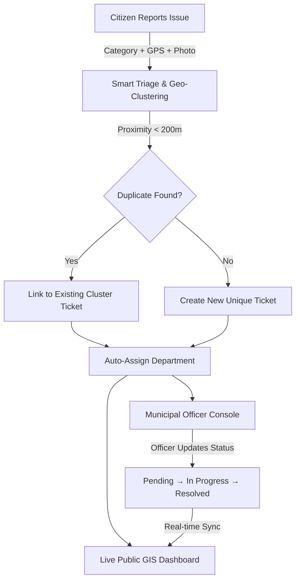

# 🏛️ CivicConnect — Smart Civic Grievance & Transparency Platform
### *Developed by Team TechTitans for Vikshit Bharat Hackathon*

CivicConnect is a next-generation civic issue reporting and municipal transparency platform. It empowers citizens to report civic infrastructure problems (potholes, garbage accumulation, drainage overflows, streetlight failures) with photo evidence and GPS coordinates, while automating departmental routing, geospatial duplicate detection, and live resolution tracking.

---

## 🌟 How It Works (End-to-End Workflow)



### 1. 📱 Citizen Issue Reporting (`/`)
- **Category Selection**: Citizens choose the issue category (`🕳️ Pothole`, `🗑️ Garbage Waste`, `💧 Drain Overflow`, `💡 Streetlight Fault`).
- **Automated Department Routing**: The system automatically assigns the issue to the appropriate governing authority:
  - Potholes ➔ **PWD (Public Works Department)**
  - Garbage ➔ **Solid Waste Management**
  - Drain Overflow ➔ **KMC Drainage Division**
  - Streetlight ➔ **CESC Power & Lighting**
- **GPS Location Capture**: 1-click GPS geolocation pinpoints exact geographical coordinates (`Latitude` & `Longitude`).
- **Photo Evidence Preview**: Real-time thumbnail preview of uploaded evidence before submission.
- **Smart Confirmation Modal**: Once submitted, citizens receive an instant confirmation popup showing their **Ticket ID**, assigned department, photo preview, and duplicate status alert.

### 2. ⚡ Geospatial Duplicate Detection Engine
- When a complaint is submitted, the system automatically checks for existing complaints of the same category within a **~200-meter radius** reported within the last 48 hours.
- If a match is found, the new report is automatically tagged as a **Linked Duplicate** and clustered under the parent ticket.
- **Benefit**: Prevents multiple municipal repair crews from being dispatched to the exact same pothole or garbage heap, saving municipal resources.

### 3. 📊 Live Public Transparency Dashboard (`/dashboard`)
- **Real-Time Metric Cards**: Displays live counters for **Total Reports**, **Pending Action**, **In Progress**, and **Resolved**.
- **Interactive OpenStreetMap GIS**: Visualizes all civic incidents on an interactive map with color-coded markers:
  - 🔴 **Red**: Pending Verification
  - 🟡 **Amber**: Work In Progress
  - 🟢 **Green**: Resolved & Verified
- **Interactive Marker Popups**: Clicking any pin reveals the photo evidence, category icon, description, department, and duplicate notice.
- **Dynamic Category Filters & Search**: Filter issues by category with live count badges (`All (14)`, `Potholes (4)`, `Waste (4)`, etc.) or search by location and keyword.
- **Live Incident Feed**: Chronological list of citizen complaints updating seamlessly.

### 4. 🛡️ Municipal Officer Admin Console (`/admin`)
- **Secure Access**: Officer login with passcode (`techtitans2026`) or 1-click fast demo access.
- **Live Status Progression**: Municipal officers can update complaint statuses from a dropdown (`Pending` ➔ `In Progress` ➔ `Resolved`).
- **Cross-Platform Sync**: Any status update in the admin console instantly updates the public dashboard and map in real-time.
- **Departmental Filtering**: Officers can filter complaints by department to manage their specific workload.

---

## 🛠️ Technology Stack

| Layer | Technology |
|---|---|
| **Frontend Framework** | [Next.js 14](https://nextjs.org/) (App Router, React 18, TypeScript) |
| **Styling & UI** | [Tailwind CSS](https://tailwindcss.com/) with modern Glassmorphism design system |
| **GIS & Mapping** | [Leaflet](https://leafletjs.com/) & [React-Leaflet](https://react-leaflet.js.org/) with OpenStreetMap tiles |
| **Data & Architecture** | Hybrid Architecture: Resilient LocalStorage Data Service + Supabase PostgreSQL |
| **Cloud Database** | [Supabase](https://supabase.com/) (PostgreSQL, Row-Level Security, Storage Buckets) |
| **Deployment** | [Vercel](https://vercel.com/) (Edge Network & Serverless CI/CD) |

---

## 🚀 Getting Started Locally

### 1. Clone the repository
```bash
git clone https://github.com/anirban8007/Techtitans_vikshitbharat.git
cd civic-mvp-full
```

### 2. Install dependencies
```bash
npm install
```

### 3. Setup Environment Variables
Create a `.env.local` file in the root directory:
```env
NEXT_PUBLIC_SUPABASE_URL=https://your-project.supabase.co
NEXT_PUBLIC_SUPABASE_ANON_KEY=your-supabase-anon-key
```

### 4. Run the development server
```bash
npm run dev
```
Open [http://localhost:3000](http://localhost:3000) in your browser.

---

## 🎬 90-Second Demo Video Script for Hackathon Presentation

1. **Introduction (0:00 - 0:15)**:
   - *"Welcome to CivicConnect, built for Vikshit Bharat to revolutionize municipal transparency and citizen grievance redressal."*
2. **Citizen Complaint Submission (0:15 - 0:40)**:
   - Open the homepage (`/`).
   - Select **🕳️ Pothole**, upload a photo, click **Capture Location**, and click **Submit Complaint**.
   - Show the **Confirmation Modal** highlighting the auto-assigned PWD department and Ticket ID.
3. **Public GIS Dashboard (0:40 - 1:05)**:
   - Navigate to `/dashboard`.
   - Show the live counter update, interactive OpenStreetMap with colored pins, and filter by category (e.g. `Potholes`).
   - Click a pin to show the popup with the photo and status.
4. **Municipal Officer Triage (1:05 - 1:30)**:
   - Go to `/admin`, click **1-Click Demo Login**.
   - Change a complaint's status from **Pending** to **Resolved**.
   - Switch back to `/dashboard` to show the marker turn **Green (Resolved)** and the resolved counter increment instantly!

---

## 👥 Team TechTitans
Built with ❤️ for a smarter, cleaner, and digitally empowered Vikshit Bharat.
